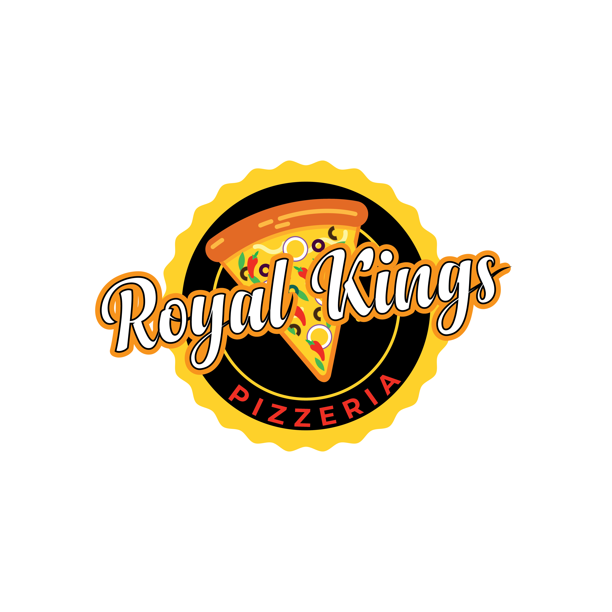

  

  

 

## 👨‍💻 About Me

I'm a passionate **Full Stack Developer** from India 🇮🇳, dedicated to crafting elegant solutions and building innovative digital experiences. I believe in learning by doing and constantly push myself to explore new technologies and methodologies.

- 🚀 Currently building **scalable web applications** using modern tech stacks
- 🎯 Focused on mastering **Full Stack Development** with React, Node.js, and MongoDB
- 🎨 Creator and developer behind multiple live production projects
- 🎵 Music producer and content creator in my free time
- 💡 Always excited to collaborate on interesting projects and ideas

 

## 🛠️ Tech Stack

### Frontend

### Backend

### Tools & Platforms

 

## 🚀 Featured Projects

<table>
  <tr>
    <td width="50%" valign="top">
      <h3 align="center">VESHH-EON</h3>
      

        
         
         
        
<strong>E-commerce Fashion Platform</strong>

        
Full-stack clothing brand website with cart management, order processing, and payment integration

        
      

    </td>
    <td width="50%" valign="top">
      <h3 align="center">Dripp Tour</h3>
      

        
         
         
        
<strong>Clothing E-commerce Marketplace</strong>

        
Multi-vendor e-commerce marketplace connecting fashion brands and customers with seamless product listings and order management

        
      

    </td>
  </tr>
  <tr>
    <td width="50%" valign="top">
      <h3 align="center">Royal King's Pizzeria</h3>
      

        
         
         
        
<strong>Restaurant Ordering System</strong>

        
Modern food ordering platform with real-time cart updates and checkout functionality

        
      

    </td>
    <td width="50%" valign="top">
      <h3 align="center">Gogo's Cafe</h3>
      

        
         
         
        
<strong>Cafe Website</strong>

        
Responsive cafe website showcasing menu items and ambiance with modern design

        
      

    </td>
  </tr>
</table>

 

## 📊 GitHub Statistics

  
  

  
  

 

## 🎵 Beyond Code

When I'm not coding, you can find me:
- 🎹 Creating music and producing beats as a music producer
- 📹 Making content for my YouTube channel [Rishi Mind](https://youtube.com/@rishimind.)
- 🎸 Exploring new sounds and musical techniques
- 📚 Reading about technology, philosophy, and personal development

 

## 🤝 Let's Connect

  
  
  
  

 

  

---

  <i>💡 "Code is like humor. When you have to explain it, it's bad." – Cory House</i>
   
   
  <strong>⭐ From <a href="https://github.com/Vighneshshetty002">Vighnesh Shetty</a></strong>

